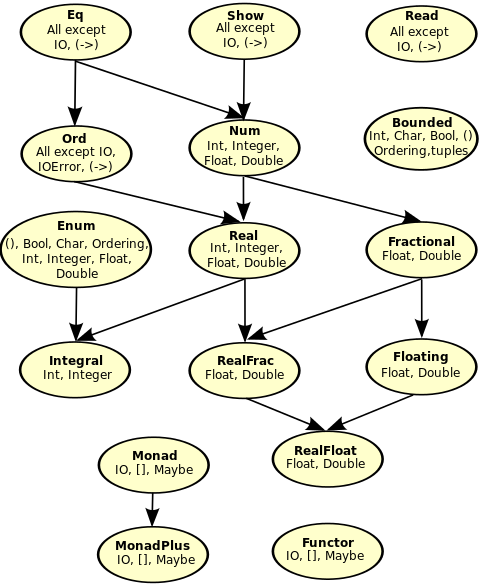

#Šta je Haskell i šta ga čini u osnovi?
-----------------------------------------
Haskell. Ime koje se često izgovara u programerskim krugovima ili kao predmet razonode
ili kao predmet obožavanja. Haskell je funkcionalni programski jezik, bez ikakvih 
primesa ostalih paradigmi (poput objektno orijentisane ili imperativne paradigme), čime
u startu ljudi postaju odbijeni od njega, a posebno kada im se kaže da Haskell ne sadrži
promenljive niti petlje. Sve u Haskell-u su funkcije. Svaka funkcija u Haskellu je "čista" funkcija
iliti funkcija koja uvek vraća rezultat koji je određen ulaznim parametrima, bez bočnih efekata.
Bočni efekti predstavljaju skup promena gde se menja neko stanje iz "spoljnog sveta" (poput globalne promenljive;
u ovom slučaju, "unutrašnji svet" predstavlja doseg funkcije).

Naravno, ima još koncepata koji čine funkcionalni jezik, poput funkcija višeg reda,
currying-a, monada, rekurzije (koja se koristi svuda gde bi se koristila petlja; naravno
ne koristi se klasična rekurzija koja se uči, nego njena optimizovana varijanta, tzv. rekurzija repa
(tail recursion) i matematičkog aparata koji se zove teorija kategorija (koji pak povlači svoje pojmove
poput funktora, morfizama, kategorija i sličnoga). Ovo ne treba da vas brine (za sada) jer ćemo proći
svaki od ovih pojmova u sledećim poglavljima.

A da li ste znali da je Haskell više nego reč u etru?
Haskell koriste razne velike firme, kao što je 
[Facebook](https://code.facebook.com/posts/745068642270222/fighting-spam-with-haskell/) koji ga koristi za borbu 
protiv spam-a, ili [Microsoft](https://news.ycombinator.com/item?id=1719456) koji zapošljava osobe koje se 
zapravo bave razvitkom novih verzija Haskell-a i unapređivanjem postojećih.

Ovo nisu jedine kompanije koje ga koriste (ili koje se bave njegovim razvitkom). Koriste ga i banke, poput
[Barclays](https://www.haskell.org/communities/12-2007/html/report.html#sect7.1.2), kao i svima poznate
firme Google i Intel.

Sad kada smo Vas, čitaoca, ubedili da se Haskell zapravo koristi, a i zaplašili, vreme je da vidimo kako
Haskell može da pomogne u svakodnevnim programerskim aktivnostima. Koristeći Haskell, Vi, kao programer,
ne govorite računaru **šta on treba da uradi da bi došao do rezultata**, nego **kako rezultat treba da izgleda**. Samim time, Haskell
je *deklarativni* programski jezik (poput SQL-a). 

Primer: želimo da iz niza elemenata `[1,2,3,4,5]` izvadite sve elementi koji su deljivi sa dva i da ih
ispišete na ekran.

U imperativnom programskom jeziku, poput Javascript-a, algoritam bi izgledao ovako:
```
var niz = [1, 2, 3, 4, 5];
for(var i = 0; i < niz.length; i++) {
	if(niz[i] % 2 === 0)
		console.log(niz[i] + '\n');	
}
```
Rezultat bi bio: 
```
2
4
```
Obratite pažnju da smo mi računari rekli *svaki korak* koji on treba da uradi da bi ispisao vrednosti (za svaki
element niza, počevši od nulte pozicije, pa do maksimalne pozicije, ne uključujući nju, sa korakom od jedne 
pozicije, proveri da li je trenutni element na koraku iz niza deljiv bez ostatka sa dva; ako jeste, ispiši ga na 
standardni izlaz).

U Haskell-u, ovo bi se moglo uraditi na sledeći način:
```
[x | x <- [1,2,3,4,5], mod x 2 == 0]
```

Rezultat je nova lista (pošto Haskell ne sadrži koncept nizova; to su zapravo liste):
```
[2,4]
```

Kako čitamo ovaj kod napisan u Haskell-u? Nikakav problem, čak je i smisleniji nego
u slučaju Javascript-a: 
```
Postoji vrednost `x` koja za svaki element niza `[1, 2, 3, 4, 5]` radi proveru
da li je on paran; ako jeste, vrati listu sa tim nizom.
```

Odjednom imamo problem: kako to mislimo da vrati listu samo sa tim nizom? Šta ako imamo
više elemenata koji zadovoljavaju uslov parnosti?

Kao što je rečeno, Haskell koristi rekurziju u najvećoj mogućoj meri. Umesto da vrati listu
odmah prilikom završetka, on *generiše* listu posle svakog rekurzivnog poziva. Naime,
on ne vraća listu `[2,4]`. On zapravo vraća **funkciju** `2:4:[]` koja kreira listu. Ova
funkcija se može pročitati na sledeći način: dodati na prvo mesto u praznu listu element 4, a potom
element 2.

Odjednom se pojavljuje pitanje: kako smo zapravo došli do toga da stavljamo prvo element
4, a potom element 2? Nije valjda da Haskell radi sve naopako?

Koliko god to lepo zvučalo, Haskell ne obrće svet naopačke (previše). Glavni princip je da se Haskell prvenstveno
čita **sa desne strane na levu**, tako da, prvo što je urađeno jeste definisana *nova funkcija* koja se sastoji
od funkcije `mod 2`. Malo čudno izgleda, zar ne? I gde onda stavljamo parametar koji se ispituje?

Oblik ove funkcije izgleda slučno zbog jednog prostog razloga: prefiksna notacija. Prefiksnom notacijom se
definiše **funkcija** (mod, sabiranje, oduzimanje itd.) pre nego što se definišu njeni parametri.

Primer: ako bismo hteli da napišemo `1 + 2` u prefiksnoj notaciji, to bi izgledalo ovako `+ 1 2`. Zašto se 
koristi prefiksna notacija, umesto ustaljene infiksne? Iz prostog razloga zato što se onda omogućava lakše
razumevanje i pisanje **kompozicije funkcija**, kao i korišćenje i razumevanja ostalih koncepata funkcionalnog
programiranja, poput **funkcija višeg reda** i **currying**-a. Naravno, uvek možemo i da koristimo infiksnu
notaciju ako nam je lakše za razumevanje (prilikom analize pre kompajliranja, za neke funkcije se i preporučuje
klasična, infiksna forma; jedna od njih je funkcija `elem` koja proverava da li je određena vrednost element
liste). Infiksnu formu aktiviramo koristeći karakter ` pre korišćenja funkcije.

Primer: umesto `mod 6 2`, gde se vrši provera ostatka prilikom deljenja broja 6 sa brojem dva, možemo da napišemo
`6` `` `mod` `` `2`

Dobro, a šta se onda dešava sa parametrom koji hoćemo da ispitamo? Gde ga stavljamo? Za to se koriste gore 
navedeni koncepti.

**Funkcije višeg reda** (iliti **funktori**) predstavljaju funkcije koje primaju jednu ili više funkcija kao 
parametar ili vraćaju funkciju kao rezultat. Idealno, one ispunjavaju obe ove karakteristike.

Šta nam ovo omogućava? Ovo nam omogućava da izbegnemo korišćenje promenljivih, samim time štedeći memorijski
prostor (pošto se funkcija ne izvršava do trenutka kada je potrebna vrednost koju ona vraća; ovo se zove
"lenja evaluacija" ili *lazy evaluation*) po cenu dodatnih ciklusa izvršavanja. Pored toga, korišćenje
funkcija višeg reda nam omogućava da, na osnovu njih, kreiramo druge funkcije višeg reda ili čak funkcije
prvog reda (obične funkcije), u zavisnosti od naših potreba. 

Proces kreiranja nove funkcije koja prima manje parametara nego prvobitna funkcija, ali gde su svi parametri 
funkcije koje sadrže jedan parametar (parcijalna primena funkcije) se zove **currying**. Kako radi postupak
"u suprotnom smeru"? Prosto. Vrednost koja je prosleđena *curry*-evanoj funkciji biva dalje prosleđena kroz
funkcije koje su korišćene da bi se ona napravila.

Možda je ovo pomalo poznato. Naravno, pošto je ovaj koncept poznat u matematici već mnogo vremena kao
**kompozicija funkcija**. Kompozicija funkcija predstavlja jedan od osnovnih matematičkih koncepata na kome
je zasnovan Haskell.

Vraćamo se nazad na primer; trenutno imamo funkciju `mod` na koju je parcijalno primenjena funkcija koja 
predstavlja broj 2 (u Haskell-u se funkcije nalaze iza svega; u ovom slučaju, broj 2 predstavlja funkcija koja 
generiše broj 2). Dobili smo novu funkciju, nazovimo je `ostatakSaDva`, koja prima jedan parametar: broj i na
osnovu koga se vraća numerička vrednost koja predstavlja ostatak prilikom deljenja sa dva (ili funkcija koja
generiše broj 0 ili funkcija koja generiše broj 1). Samim time, urađen je *currying* funkcije `mod`.

Šta se dalje dešava? I dalje imamo listu brojeva `[1,2,3,4,5]` iz koje je neophodno kreirati novu listu sa
elementima koji su parni (iliti deljivi sa dva bez ostatka). Kao što je rečeno, Haskell koristi rekurziju i
"rekurziju repa" - *tail recursion*, radi izvršavanja prolaza kroz određeni skup podataka. Ako se setimo da
je cilj rekurzije smanjenje obima problema do trivijalnog rešenja, možemo zaključiti da je neophodno krenuti od
zadnjeg elementa liste, a potom konvergirati do početnog elementa.

Sad kada smo naoružani sa ovim objašnjenjima, možemo da tvrdimo sledeće za gore navedeni primer:

Vrši se rekurzivni prolazak kroz listu, primenjujući svaki element na *curry*-evanu funkciju `mod 2` proveravajući
da li je rezultujuća vrednost identična sa brojem `0`. U slučaju da jeste, dodati je na postojeću listu rešenja.

Gore sam napisao o famoznom `2:4:[]`. Pogledajte malo bolje. I ovo je rekurzija (ili rekurentna relacija), ali u 
suprotnom smeru. Krećemo od početnog rešenja koje predstavlja prazna lista `[]` (jer je moguće da nijedan od 
elemenata liste nije deljiv sa brojem 2) i potom na nju rekurzivno primenjujemo operaciju konkatenacije `:` 
zajedno sa brojem koji odgovara gore navedenom uslovu.

Definisanje funkcija i njihovi potpisi
--------------------------------------

Recimo da želimo da imamo funkciju koju hoćemo dalje da koristimo u našem programu. Neka je to nešto poput naše
funkcije koja nam daje ostatak pri deljenju sa dva. Kako bismo mogli da je definišemo, tako da je dalje koristimo
prilikom izvršavanja našeg programa? Lako, napravićemo **imenovanu** funkciju koja će obuhvatati našu funkciju.

Zašto sam stavio akcenat na reč **imenovanu**? Zato što funkcija u formatu kome smo je koristili do sada je bila
**neimenovana funkcija**, što znači da nije mogla da se koristi dalje od dosega funkcije u kojoj je pozana. Drugi
naziv za neimenovane funkcije jeste **closure** ili **lambda funkcije**. Postoji još jedan način za definisanje
lambda funkcije, ali o njemu više malo kasnije.

Kako pravimo imenovanu funkciju? Za početak, potreban nam je naziv nove funkcije - neka bude, kao gore, 
`ostatakSaDva`.

Definišemo je na sledeći način:
```
ostatakSaDva x = mod x 2 
```

Iako liči, ovo nije promenljiva. Ovo je samo nova funkcija, koja prima jedan parametar (koji smo mi, u njenom
dosegu nazvali `x`). Lako se može zaključiti da će ova funkcija vratiti rezultat funkcije koja računa ostatak
pri deljenju broja `x` sa brojem 2.

Iako se ne čini na prvi pogled, ali postoji potencijalni problem: šta ako funkciji prosledimo nešto što **nije**
deljivo sa brojem 2 ni pod stavkom razno, poput stringa? Ili karaktera? Ili funkcije koja, kao izlaz, daje nešto
što se ne može podeliti sa brojem 2? Neophodno je da definišemo tip podataka parametra funkcije, a i kad smo već 
tu, mogli bismo da definišemo tip podatka povratne vrednosti.

Za razliku od "ustaljenih" načina definisanja ulaznog tipa podatka i povratne vrednosti (npr. u programskom 
jeziku C#, `int ostatakSaDva(int x)`), Haskell koristi drugačiji način za definisanje povratnih tipova koji je u 
početku teži za razumevanje, ali kasnije omogućava lakše razumevanje prilikom kompozicije funkcija i određivanja 
parametara koje funkcije prosleđuju međusobno. Takav tip se zove **Hindli - Milner sistem tipova** (ili u 
originalu *Hindley - Milner type system*).

**Hindli - Milner sistem tipova** je sistem za definisanje tipova podataka u lambda računu sa parametarskim 
polimorfizmom. Vau, to je zvučalo preteško i nepotrebno. Iako se čini tako, zapravo je lako za razumevanje. 

Lambda račun, kao jedna od osnovnih komponenti koja pogoni Haskell, se definiše kao formalni sistem u 
matematičkoj logici za iskazivanje računa koristeći apstrakciju funkcija i njihovu primenu putem povezivanja i 
zamena vrednosti koje koriste. Ukratko rečeno, sve što smo već prošli dok smo radili prethodni primer - 
kompozicija funkcija, funkcije višeg reda i *currying*.

Sada kada znamo šta je lambda račun, šta je onda parametarski polimorfizam. Po samom poreklu reči, može se
zaključiti da postoje određeni tipovi koji su podskupovi drugih, opštijih tipova. **Parametarski polimorfizam**
predstavlja koncept koji omogućava definisanje tipova podataka (ili čak funkcija) koje su generične za ostale
tipove.

Primer: Haskell ima tip podatka `Real`. To je generički tip podatka, koji pruža operacije nad njime, kao i nad
njegovim naslednicima. Konkretniji primer tipa podatka od `Real`-a bi bio tip podatka `Integral` koji
implementuje operacije celobrojnog deljenja, kao i operacije određivanja ostatka. Istovremeno, `Real` je podtip
tipa podataka `Num` koji definiše brojeve. Sledeća slika bi to mogla mnogo bolje da opiše (preuzeto sa 
[Wikibooks](https://en.wikibooks.org/wiki/Main_Page)):



Hajde da prepišemo našu funkciju `ostatakSaDva`, tako da budemo osigurani u slučaju problematičnih ulaznih
parametara. Njen novi oblik bi, napisan putem Hindli - Milner sistema tipova, izgledao ovako:
```
ostatakSaDva :: (Integral a) => a -> a
```

Možda se čini kompleksnim (ipak ste upozoreni), ali nije. Deo `(Integral a)` definiše tip podataka koji se može
koristiti u radu funkcije i dodeljuje mu alias `a` radi lakšeg razumevanja. Oznaka `=>` predstavlja da je gotov
deo definisanja alijasa i da može da se krene sa radom na tipovima podataka ulaznih podataka, kao i na tipovima
podataka izlaznih podataka. Samim time, ako znamo da `Integral` predstavlja ceo broj i da mu je dat alias `a`,
deo `a -> a` postaje jasan i može se protumačiti kao `za ulazni parametar koji je predstavljen aliasom a, vrati
nakon izvršenja podataka koji ima tip podataka koji se može predstaviti aliasom a`.

Sada možemo u kodu koristiti našu funkciju bez bojazni da neće raditi.

Zaključak
---------

U ovom poglavlju upoznali smo šta je Haskell, ko ga koristi i kako, kao i kako se on koristi u programiranju.
Pored toga, prošli smo i kroz glavne koncepte koji čine Haskell, poput funkcija višeg reda, *currying*-a, 
lambda računa, Hindli - Milnerovog sistema tipova kroz primer gde je data alternativna implementacija u 
programskom jeziku Javascript. Na kraju smo definisali našu funkciju, sa i bez Hindli - Milnerovog sistema tipova
koju možemo koristiti u daljem programiranju.