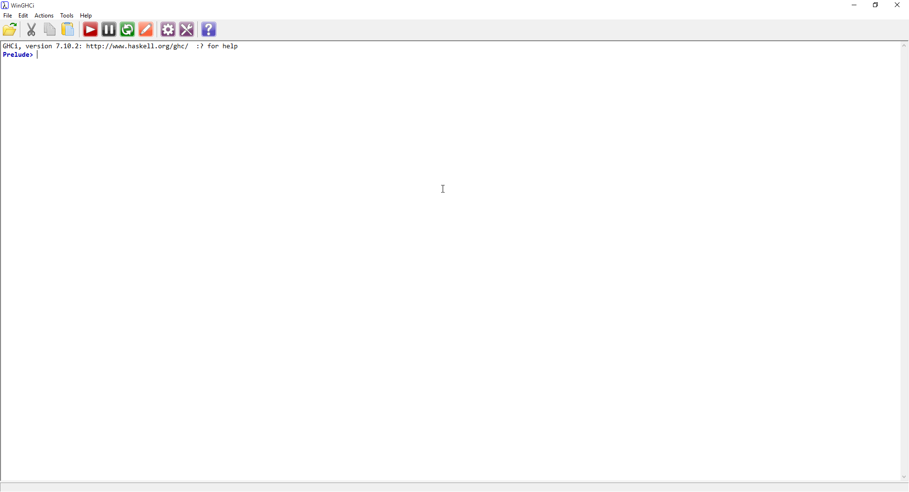
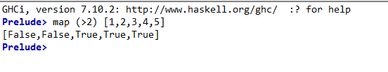
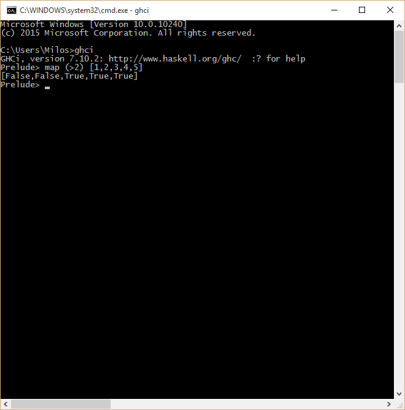

#Interpreter i kompajler
------------------------

Uvod
----

Haskell, kao viši programski jezik, ima jednu zanimljivu stavku kad je u pitanju način na koji
se programi napisani u njemu izvršavaju. Naime, Haskell omogućava i kompajliranje i
interpretaciju programa, tako da se može koristiti istovremeno i kao skripting jezik, kao i
jezik opštije namene. Pored toga, u zavisnosti od implementacije kompajlera koja se koristi,
moguće je i kreiranje Haskell *bytecode*-a.

Kompajleri i interpreteri
-------------------------

Aktuelna verzija programskog jezika Haskell je Haskell 2010, tako da ćemo se njom baviti
u daljem radu. Postoje i druge verzije poput Haskell 1998.

Postoji nekoliko implementacija Haskell-a. Jedna od najpopularnijih je 
[GHC](https://www.haskell.org/ghc/) ili *Glasgow Haskell Compiler*. Glavna prednost GHC-a
je u tome što se putem njega aktivno razvija jezik, kao i mogućnost dodatne optimizacije koja
se postiže njegovim korišćenjem. Jedan od kompajlera koji je takođe popularan, ali pruža i
mogućnost kompilacije u *bytecode* jeste [UHC](https://wiki.haskell.org/UHC) ili *Utrecht
Haskell Compiler*. Još jedan od zanimljivijih primera jeste i 
[LHC](https://github.com/Lemmih/lhc), ili *LLVM Haskell Compiler*, koji koristi mogućnosti
koje pruža [LLVM](http://llvm.org/) platforma. Samim time što određene varijante BSD
operativnih sistema koriste *clang* C kompajler, koji je deo *LLVM* platforme (ona izvršava
*bytecode* generisan od strane *LLVM* kompajlera), moguće je (teoretski) koristiti Haskell
za svrhu sistemskog programiranja na sistemima koji koriste *LLVM* kao platformu za
kompilaciju.

U ostatku knjige se bavimo samo sa *GHC* kompajlerom i njegovom REPL (*read, evaluate, print, 
loop* - skup koraka koji se koriste prilikom interaktivnih interpretatora jezika) 
implementacijom za interpretiranje jezika: `ghci` (skraćeno od *Glasgow Haskell Compiler 
Interactive*).

Instalacija
-----------

Najbrži i najbezbolniji način instalacije Haskell-a za Vaš operativni sistem je putem *Haskell Platform*
instalacionog paketa. On se može preuzeti [ovde](https://www.haskell.org/platform/) i dostupan je za sve
aktuelne platforme.

Sa njim dobijate `GHC` kompajler sa interpreterom, `cabal` upravljač paketa kojim se mogu instalirati 
paketi kojima se proširuje funkcionalnost Haskell-a i 35 najkorišćenijih paketa (najčešće za rad sa
strukturama podataka i povezivanje sa sistemskim funkcijama).

Interpreter
------------
U slučaju operativnog sistema Windows, nakon instalacije najlakši način za početak Haskell avantura
jeste sa otvaranjem interpretera (isto je i za ostale platforme, ali ne garantujem da će iskustvo i 
doživljaj biti identičan). 

Interpreter može da se pokrene na dva načina: 
* Koristeći *Command prompt* i izvršavanjem komande `ghci`
* Pokretanjem programa WinGHCi

U toku daljeg rada ćemo koristiti `WinGHCi`, kao i tekstualni editor (nebitno koji).

Nakon pokretanja dočekaće nas sledeći prozor:

Neophodno je obratiti pažnju na centralni, beli deo ekrana.
`Prelude>` predstavlja više stvari:
* Početna linija na kojoj se ispisuju komande
* Biblioteke koje su trenutno uvezene u kontekst programa; u ovom trenutku, to je samo `Prelude`

`Prelude` predstavlja standardnu biblioteku, kao što je to `System` u slučaju programskog jezika C#
ili `stdio.h` u slučaju programskog jezika C.

Pritiskom na Enter se vrši evaluacija unetog izraza. Kao primer smo uneli izraz `map (>2) [1,2,3,4,5]`
koji se čita kao:

`Napraviti novu listu istih dimenzija kao početna gde na odgovarajućem mestu se nalazi rešenje provere 
elementa sa predikatom koji proverava da li je element veći od broja dva.`

Kao i što je očekivano, dobili smo niz istih dimenzija kao početni gde se na svakoj poziciji, analogno
poziciji elementa u početnoj listi nalazi vrednost `False`, u slučaju da element nije veći od broja 2 ili 
`True`, u slučaju da je element veći od broja dva : 

`[False,False,True,True,True]`

Identično rešenje bi se dobili da smo koristili *Command prompt*:

Kompajler
---------

Zaključak
---------